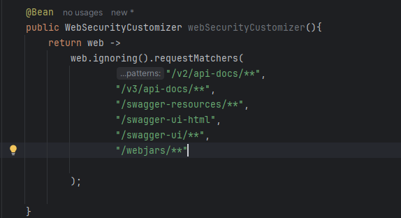

# Swagger-Open-API

  - [Tecnologias Usadas](#Tecnologias-Usadas)
  - [Sobre](#Sobre)
  - [Inicio](#Inicio)

## Tecnologias Usadas

[Java](https://www.java.com/pt-BR/) / [Spring](https://spring.io/projects/spring-boot) / [Docker](https://www.docker.com/) / [PostgresSQL](https://www.postgresql.org/) / [Pgadmin4](https://www.pgadmin.org/download/pgadmin-4-windows/) / [Thymeleaf](https://www.thymeleaf.org/) / [HTML5](https://pt.wikipedia.org/wiki/HTML5)
 / [Postman](https://www.postman.com/) / [Google Cloud](https://cloud.google.com/?hl=pt-BR) / [Swagger](https://swagger.io/)

## Sobre

Iremos implmentar o swagger para documentar um [projeto](https://github.com/Hugoftf/Spring-Security-Authorization-Service) passado de API em uma pagina web com seus exemplos de seus funcionamentos. O Swagger é um conjunto de ferramentas para projetar, documentar, consumir e testar APIs RESTful.

## Inicio

Para começar iremos adicionar o starter open api para habilitar o swagger:

Depois disso já está habilitado o swwager, como nossa API contem a camada security, precisamos desabilitar a autenticação para as urls do swagger para podemos acessar sem precisar se autenticar:

Feito isso, podemos acessar o swagger:

Ainda assim para executar alguns funcionamentos precisamos se autenticar. Então os proximos passos iremos editar um pouco dessa interface do swagger e editar para os funcionamentos da página
sejam autenticados automaticamente.

