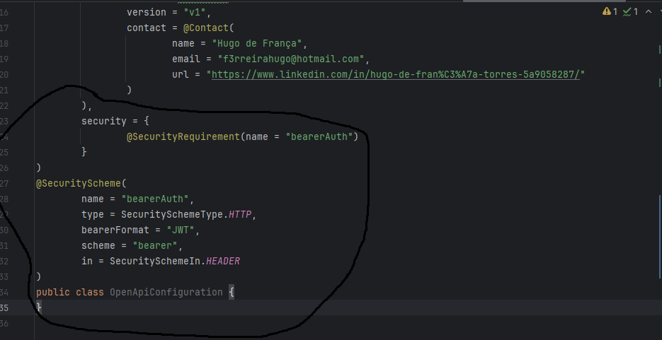

# Swagger-Open-API

  - [Tecnologias Usadas](#Tecnologias-Usadas)
  - [Sobre](#Sobre)
  - [Inicio](#Inicio)
  - [Configurando e Documentando](#Documentando)

## Tecnologias Usadas

[Java](https://www.java.com/pt-BR/) / [Spring](https://spring.io/projects/spring-boot) / [Docker](https://www.docker.com/) / [PostgresSQL](https://www.postgresql.org/) / [Pgadmin4](https://www.pgadmin.org/download/pgadmin-4-windows/) / [Thymeleaf](https://www.thymeleaf.org/) / [HTML5](https://pt.wikipedia.org/wiki/HTML5)
 / [Postman](https://www.postman.com/) / [Google Cloud](https://cloud.google.com/?hl=pt-BR) / [Swagger/OpenAPI](https://swagger.io/)

## Sobre

Iremos implmentar o swagger para documentar um [projeto](https://github.com/Hugoftf/Spring-Security-Authorization-Service) passado de API em uma pagina web com seus exemplos de seus funcionamentos. O Swagger é um conjunto de ferramentas para projetar, documentar, consumir e testar APIs RESTful.

## Inicio

Para começar iremos adicionar o starter open api para habilitar o swagger:

Depois disso já está habilitado o swwager, como nossa API contem a camada security, precisamos desabilitar a autenticação para as urls do swagger para podemos acessar sem precisar se autenticar:

Feito isso, podemos acessar o swagger:

Ainda assim para executar alguns funcionamentos precisamos se autenticar. Então os proximos passos iremos editar um pouco dessa interface do swagger e editar para os funcionamentos da página
sejam autenticados automaticamente.

## Documentando

Para começar a configurar e documentar minha API, iremos criar uma classe no pacote confi chamada de OpenAPiConfiguration, ela irá simular a parte inicial da minha Documentação e também para configurações:

Ela carrega informações iniciais de contatos e titulos.

Em seguida, na camada controller da nossa API de autores, iremos documenta-lá:

A começar pelo corpo da classe, recebendo a anotação @Tag que edita o titulo da aba da nossa API no Swagger. Depois documentando no metodo salvar:

Básicamete iremos descrever a funcionalidade do metodos e cada retorno possivel com codigos de http que nosso podem acontecer no nosso metodo. Com isso o retorno no swagger fica dessa forma:

Esse é o titulo contendo as informações de contato, meu nome, web site, email, etc. Partindo para API de autor ficou dessa forma:

Contendo mais informações editadas/documentadas mais abaixos.

Agora iremos documentar todos os metodos incluindo o record AutorDTO. A começar pelo record AutorDTO:

Para os DTO's a anotação que usamos tanto para corpo do record quanto para campos é a @Scherma, sua utilidade principal é editar o nome do campo no swagger.

Voltando para a camada controller o proximo metodo a ser editado é o obterDetalhes:

Agora o metodo deletar:

Metodo Pesquisar:

Metodo Atualizar:

#### Configurando o Security Scherme

Para começar, iremos remover as respostas genericas que o swagger ao escanear nossa API cria baseadas na nossa classe de GlobalExceções que podem ocorrer na API para todas as requisições. Iremos adicionar mais uma prorpriedade no application.yml:

Depois na classe OpenAPIConfiguration, iremos adicionar configurações adicionais atraves de anotações:

Basicamente essas configurações vão fazer que nosso swagger irá se autenticar via token e passar informações pelo hearder.

O retorno no nosso swagger:

E por fim pode se autenticar via token:

